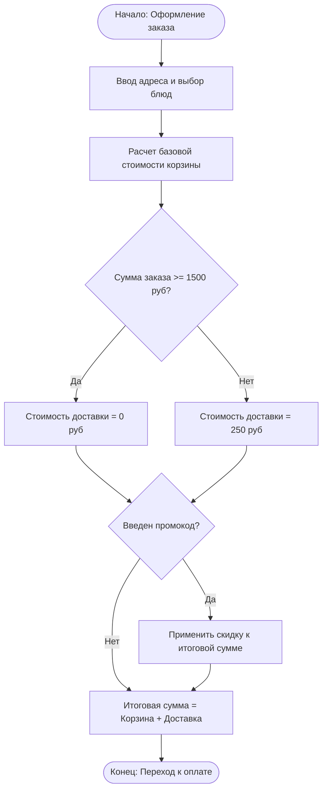

# 3.4. Flowchart

```mermaid
flowchart TD
    Start([Начало: Оформление заказа]) --> Input[Ввод адреса и выбор блюд]
    Input --> CalcBase[Расчет базовой стоимости корзины]
    
    CalcBase --> CheckSum{Сумма заказа >= 1500 руб?}
    CheckSum -- Да --> FreeDelivery[Стоимость доставки = 0 руб]
    CheckSum -- Нет --> PaidDelivery[Стоимость доставки = 250 руб]
    
    FreeDelivery --> CheckPromo{Введен промокод?}
    PaidDelivery --> CheckPromo
    
    CheckPromo -- Да --> ApplyDiscount[Применить скидку к итоговой сумме]
    CheckPromo -- Нет --> TotalSum[Итоговая сумма = Корзина + Доставка]
    
    ApplyDiscount --> TotalSum
    TotalSum --> End([Конец: Переход к оплате])
```
