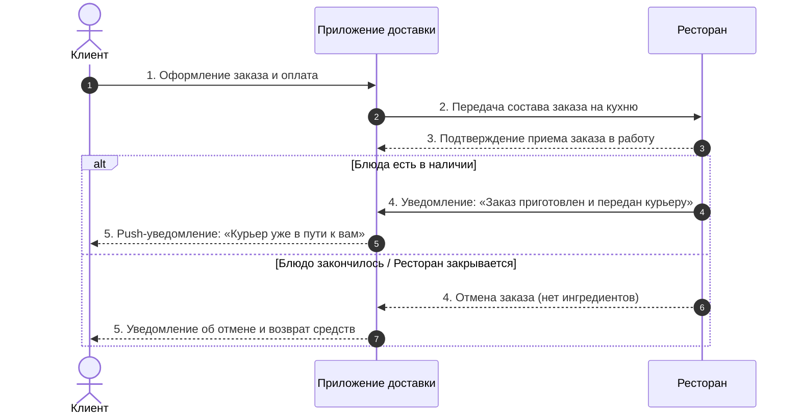

# 3.3. Sequence Diagram

```mermaid
sequenceDiagram
    autonumber
    actor Client as Клиент
    participant App as Приложение доставки
    participant Rest as Ресторан

    Client->>App: 1. Оформление заказа и оплата
    App->>Rest: 2. Передача состава заказа на кухню
    Rest-->>App: 3. Подтверждение приема заказа в работу

    alt Блюда есть в наличии
        Rest->>App: 4. Уведомление: «Заказ приготовлен и передан курьеру»
        App-->>Client: 5. Push-уведомление: «Курьер уже в пути к вам»
    else Блюдо закончилось / Ресторан закрывается
        Rest-->>App: 4. Отмена заказа (нет ингредиентов)
        App-->>Client: 5. Уведомление об отмене и возврат средств
    end
```
